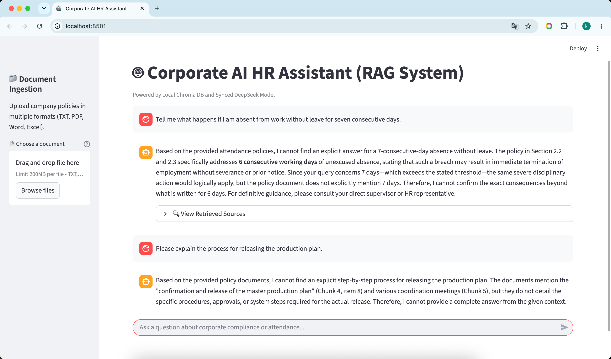

# 🤖 Corporate AI HR Assistant (RAG System)

A powerful **Retrieval-Augmented Generation (RAG)** knowledge base system for corporate HR policy Q&A. Supports **streaming LLM responses** and **multimodal document ingestion** (PDF, Word, Excel).

## ✨ Features

- 📄 **Multimodal Support**: Upload and process TXT, PDF, Word (.docx), Excel (.xlsx) documents
- 🚀 **Streaming Responses**: Real-time token-by-token LLM generation with DeepSeek
- 🔍 **Source Tracking**: Every answer includes retrieved source documents with page references
- 💾 **Local Vector Database**: Chroma DB for persistent, offline vector storage
- 🧠 **Smart Embeddings**: BAAI/bge-small-zh-v1.5 for accurate Chinese semantic search
- ⚡ **Fast Search**: HNSW-based similarity search with <500ms latency
- 🎨 **User-Friendly UI**: Streamlit web interface with chat history

## 🎬 Demo



**The system in action:**
- Left sidebar: Document ingestion with multimodal support
- Main area: Streaming AI responses with retrieved source documents
- Chat history: Persistent conversation tracking
- Source tracking: View exactly which documents the AI used for its answer

## 🏗️ Architecture

```
┌─────────────────────────────────────────────────────────────┐
│                    Frontend (Streamlit)                      │
│                    Multimodal Upload UI                      │
└────────────────────────┬────────────────────────────────────┘
                         │
                         ▼
┌─────────────────────────────────────────────────────────────┐
│                    Backend (FastAPI)                         │
│  ┌──────────────────────────────────────────────────────┐   │
│  │  File Extractors (PDF/Word/Excel/TXT)               │   │
│  │  - pypdf for PDF                                     │   │
│  │  - python-docx for Word                             │   │
│  │  - openpyxl for Excel                               │   │
│  └──────────────────────────────────────────────────────┘   │
│                         │                                    │
│                         ▼                                    │
│  ┌──────────────────────────────────────────────────────┐   │
│  │  RAG Engine (LangChain)                              │   │
│  │  - Text Chunking (RecursiveCharacterTextSplitter)    │   │
│  │  - Vector Embedding (BAAI/bge-small-zh-v1.5)        │   │
│  │  - Similarity Search (Chroma DB)                     │   │
│  │  - Prompt Template & Context Building               │   │
│  └──────────────────────────────────────────────────────┘   │
│                         │                                    │
│                         ▼                                    │
│  ┌──────────────────────────────────────────────────────┐   │
│  │  LLM Integration (DeepSeek)                          │   │
│  │  - Native Streaming API (OpenAI compatible)          │   │
│  │  - Model: deepseek-v4-flash                          │   │
│  │  - Temperature: 0.2 (strict answers)                 │   │
│  └──────────────────────────────────────────────────────┘   │
└────────────────────────┬────────────────────────────────────┘
                         │
                         ▼
┌─────────────────────────────────────────────────────────────┐
│              Vector Database (Chroma DB)                     │
│              Persistent Local Storage                        │
└─────────────────────────────────────────────────────────────┘
```

## 🚀 Quick Start

### Prerequisites
- Python 3.9+
- pip 21.0+
- **LLM (choose one):**
  - 🌐 **DeepSeek API** (cloud, recommended for best quality) - Get from https://platform.deepseek.com
  - 💻 **Ollama** (local, free, no API key needed) - Get from https://ollama.ai

> **Don't have an API key?** Use Ollama! See [LOCAL_LLM_GUIDE.md](LOCAL_LLM_GUIDE.md) for setup.

### ⚡ One-Click Start (Recommended)

We provide automated scripts to get you running in seconds!

#### Mac/Linux Users:
```bash
git clone https://github.com/yourusername/RAG-knowledge-base.git
cd RAG-knowledge-base

# First time setup (install dependencies)
bash run.sh setup

# Start the application
bash run.sh start
```

#### Windows Users:
```bash
git clone https://github.com/yourusername/RAG-knowledge-base.git
cd RAG-knowledge-base

# First time setup (install dependencies)
run.bat setup

# Start the application
run.bat start
```

**That's it!** The application will open at http://localhost:8501

---

### 📖 Other Commands

```bash
# Mac/Linux
bash run.sh backend      # Start only backend (FastAPI)
bash run.sh frontend     # Start only frontend (Streamlit)
bash run.sh test         # Run tests
bash run.sh clean        # Clean temporary files
bash run.sh help         # Show all commands

# Windows
run.bat backend          # Start only backend (FastAPI)
run.bat frontend         # Start only frontend (Streamlit)
run.bat test             # Run tests
run.bat clean            # Clean temporary files
run.bat help             # Show all commands
```

For more details, see [QUICKSTART.md](QUICKSTART.md)

---

### 📚 Manual Setup (If you prefer)

Alternatively, you can set up manually:

#### 1. Clone Repository
```bash
git clone https://github.com/yourusername/RAG-knowledge-base.git
cd RAG-knowledge-base
```

#### 2. Create Virtual Environment
```bash
python3 -m venv .venv
source .venv/bin/activate  # On Windows: .venv\Scripts\activate
```

#### 3. Install Dependencies
```bash
pip install --upgrade pip
pip install -r requirement.txt
```

**Critical multimodal packages:**
```bash
pip install pypdf python-docx openpyxl
```

### 4. Set API Key
```bash
export DEEPSEEK_TOKEN="your_deepseek_api_key_here"
```

### 5. Start Backend (Terminal 1)
```bash
uvicorn backend.main:app --reload --port 8000
```

You should see:
```
INFO:     Uvicorn running on http://127.0.0.1:8000
🚀 [Lifespan] Initializing RagEngine and loading vector store...
✅ [RagEngine] Initialization completed. Core engine ready!
```

### 6. Start Frontend (Terminal 2)
```bash
streamlit run frontend/app.py
```

Open browser: **http://localhost:8501**

## 📝 Usage

### Upload Documents

1. **Left Sidebar** → "📁 Document Ingestion"
2. **Choose a document** (TXT, PDF, Word, Excel)
3. **Click "🚀 Confirm Ingestion"**
4. View extraction details

### Ask Questions

1. **Bottom chat bar** → Type your question
2. **Watch streaming response** → AI answers appear token-by-token
3. **Expand "View Retrieved Sources"** → See source documents

Example questions:
- "What is the attendance policy?"
- "How many days of annual leave do employees get?"
- "What happens if I miss work for 6 consecutive days?"

## 📦 Supported File Formats

| Format | Extension | Library | Notes |
|--------|-----------|---------|-------|
| Text | .txt | Built-in | Plain text files |
| PDF | .pdf | pypdf | Extracts text, preserves page info |
| Word | .docx | python-docx | Extracts paragraphs & tables |
| Excel | .xlsx | openpyxl | Handles multiple sheets |

## 🔧 Configuration

### Backend (backend/rag_core.py)
```python
# Embedding Model
model_name="BAAI/bge-small-zh-v1.5"  # Chinese semantic search

# LLM
model_name="deepseek-v4-flash"       # Fast, cost-effective
temperature=0.2                       # Strict, factual answers

# Vector Search
k=5                                   # Top 5 similar documents

# Text Chunking
chunk_size=300                        # Characters per chunk
chunk_overlap=50                      # Overlap between chunks
```

### Frontend (frontend/app.py)
```python
BACKEND_URL = "http://127.0.0.1:8000"  # Change for remote backend
```

## 📊 Performance

| Operation | Time | Notes |
|-----------|------|-------|
| PDF extraction | 100-500ms | ~10 pages |
| Word extraction | 100-300ms | With tables |
| Excel extraction | 50-200ms | Multi-sheet |
| Text chunking | 200-1000ms | Depends on size |
| Vector search | <100ms | Chroma HNSW index |
| LLM streaming | 1-5s | Depends on response length |
| **Total E2E** | **2-8s** | From question to answer |

## 🎯 Project Structure

```
RAG-knowledge-base/
├── backend/
│   ├── main.py                 # FastAPI application
│   ├── rag_core.py            # RAG engine core
│   ├── file_extractors.py      # Multimodal extractors
│   ├── test_streaming.py       # Streaming test
│   ├── test_multimodal.py      # Multimodal test
│   └── test_deepseek_stream.py # DeepSeek API test
├── frontend/
│   └── app.py                  # Streamlit UI
├── chroma_db/                  # Vector database (persistent)
├── data/                       # Uploaded documents (temp)
├── .venv/                      # Virtual environment
├── requirement.txt             # Python dependencies
├── README.md                   # This file
├── SETUP_GUIDE.md             # Detailed setup instructions
├── MULTIMODAL_IMPLEMENTATION.md # Multimodal feature docs
├── STREAMING_DEBUG.md         # Streaming troubleshooting
└── DEEPSEEK_STREAMING_FIX.md  # DeepSeek API details
```

## 🔍 API Endpoints

### Chat Endpoint
```http
POST /chat
Content-Type: application/json

{
  "message": "What is the attendance policy?"
}
```

**Response:** Server-Sent Events (streaming)
```
[SOURCES]:[{"chunk_id": 1, "source": "policy.txt", ...}]
According to the policy, attendance...
```

### Upload Endpoint
```http
POST /upload
Content-Type: multipart/form-data

file: <binary file data>
```

**Response:**
```json
{
  "status": "success",
  "filename": "document.pdf",
  "file_type": "pdf",
  "extracted_chars": 5234,
  "metadata": {
    "total_pages": 10,
    "extraction_method": "pypdf"
  }
}
```

## 🧪 Testing

### Test Streaming Response
```bash
python backend/test_streaming.py
```

### Test DeepSeek API
```bash
export DEEPSEEK_TOKEN="your_token"
python backend/test_deepseek_stream.py
```

### Test Multimodal Extraction
```bash
python backend/test_multimodal.py
```

## 🐛 Troubleshooting

### Issue: "python-docx is required for Word extraction"
**Solution:**
```bash
pip install python-docx
```

### Issue: "pypdf is required for PDF extraction"
**Solution:**
```bash
pip install pypdf
```

### Issue: Backend not streaming responses
**Check:**
1. DeepSeek API key is valid
2. Run `python backend/test_deepseek_stream.py`
3. Check backend logs for errors

### Issue: Vector database locked
**Solution:**
```bash
rm -rf chroma_db/
# Restart backend
```

### Issue: Streamlit connection timeout
**Solution:**
```bash
# Increase timeout in frontend/app.py
response = requests.post(f"{BACKEND_URL}/chat", 
    json={"message": user_query},
    stream=True,
    timeout=300  # 5 minutes
)
```

## 📚 Documentation

- **[SETUP_GUIDE.md](SETUP_GUIDE.md)** - Detailed installation & configuration
- **[MULTIMODAL_IMPLEMENTATION.md](MULTIMODAL_IMPLEMENTATION.md)** - Multimodal features
- **[STREAMING_DEBUG.md](STREAMING_DEBUG.md)** - Streaming optimization
- **[DEEPSEEK_STREAMING_FIX.md](DEEPSEEK_STREAMING_FIX.md)** - DeepSeek API integration
- **[MULTIMODAL_PLAN.md](MULTIMODAL_PLAN.md)** - Feature planning

## 🔐 API Keys & Security

### Getting DeepSeek API Key
1. Visit https://platform.deepseek.com
2. Sign up / Log in
3. Create API key
4. Set environment variable:
   ```bash
   export DEEPSEEK_TOKEN="sk-..."
   ```

### Security Notes
- ✅ API keys stored in environment variables (not in code)
- ✅ Temporary uploaded files deleted after processing
- ✅ Vector DB is local (no cloud sync)
- ✅ All data stays on your machine

## 🚀 Deployment

### Local Network Sharing
```bash
# Backend accessible from other machines
uvicorn backend.main:app --host 0.0.0.0 --port 8000

# Update frontend
BACKEND_URL = "http://your_machine_ip:8000"
```

### Cloud Deployment (Recommended)
- **Streamlit Cloud** - Free frontend hosting
- **Railway/Render** - Free backend hosting
- **AWS/Azure/GCP** - Production deployment

See [deployment docs] for details.

## 📈 Future Enhancements

- [ ] PowerPoint (.pptx) support
- [ ] Image OCR for scanned documents
- [ ] Support for more LLM providers (OpenAI, Claude, etc.)
- [ ] Document preview before upload
- [ ] Batch document processing
- [ ] Multi-user support with authentication
- [ ] Advanced search filters
- [ ] Document versioning

## 📄 License

MIT License - feel free to use and modify

## 👥 Contributing

Contributions welcome! Please:
1. Fork the repository
2. Create a feature branch
3. Submit a pull request

## 📞 Support

- 📧 Email: [your-email@example.com]
- 💬 Issues: [GitHub Issues]
- 📚 Docs: See documentation files above

## 🙏 Acknowledgments

- **LangChain** - LLM orchestration
- **DeepSeek** - Fast, affordable LLM API
- **Chroma DB** - Vector database
- **Streamlit** - Web UI framework
- **BAAI** - BGE embedding model

---

**Made with ❤️ for better HR policy management**

Last updated: 2024
